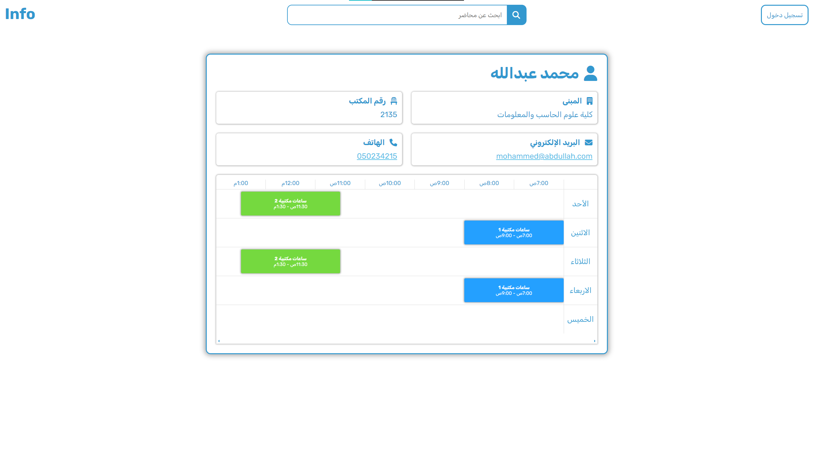
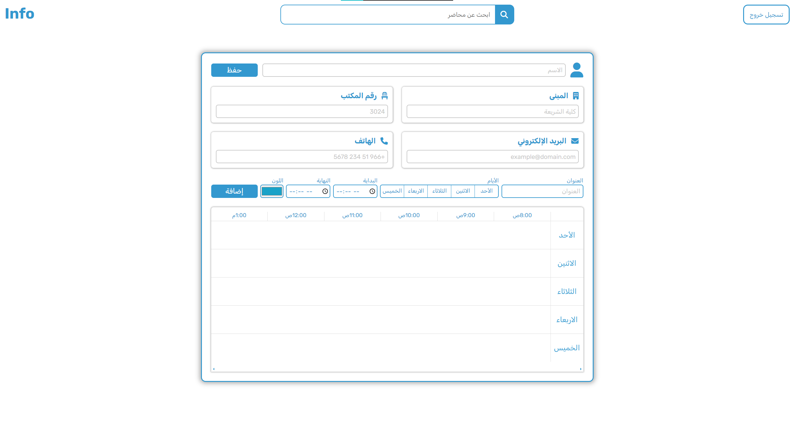

# Web Info

## Overview
The website helps the students to access lecturers' information easily, by searching by the lecturer’s name.


## Flow Chart


## Setup
### Prerequisites
- Database (MongoDB)
- Create a .env file to store MongoDB URI

### Installation Steps
1. Install npm dependencies
```
$ npm i
```
2. Start the server
```
$ npm start
```


## Technologies Used
- HTML5
- CSS
- JavaScript
- Node.js
- MongoDB
- Jquery
 

## Screenshots
- Search for instructor information by name




- Add instructor information




## Future Work
- Improving the frontend design.
- We planning to let the instructor add more information.


## Team Members
- [Fahad Alraqiba](https://github.com/FahadisGP)
- [Abdullah Alnafisah](https://github.com/abduallh-mn)